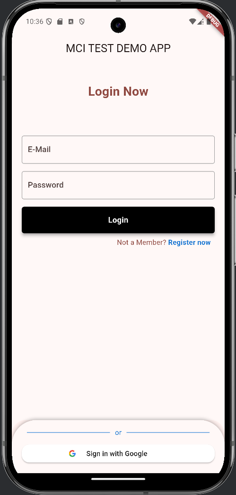
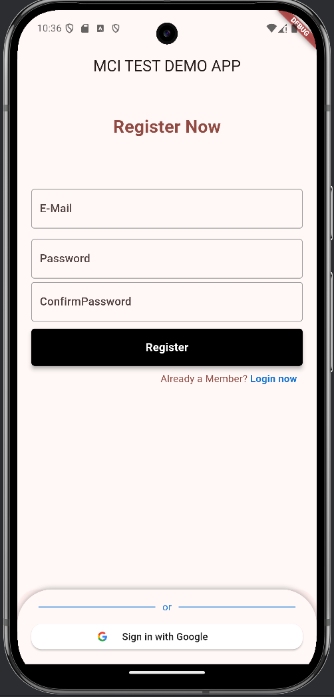
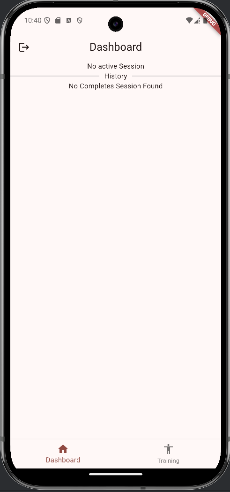
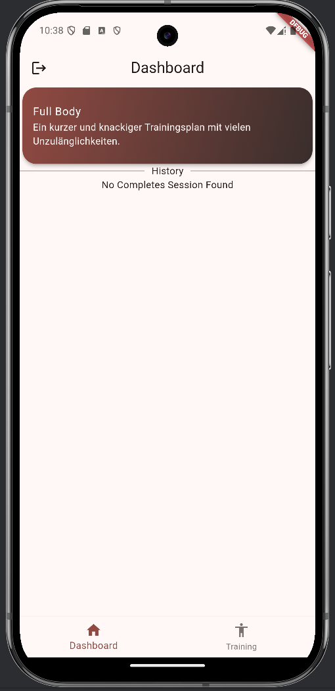
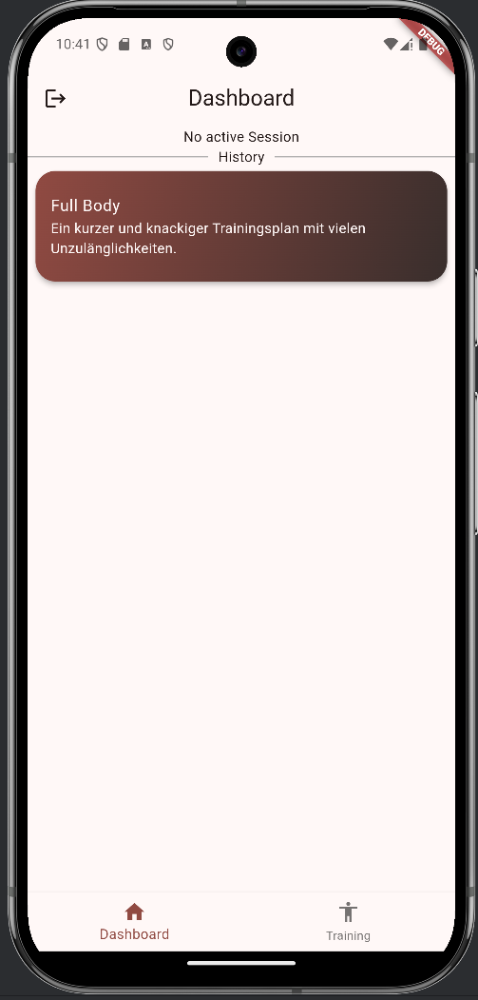
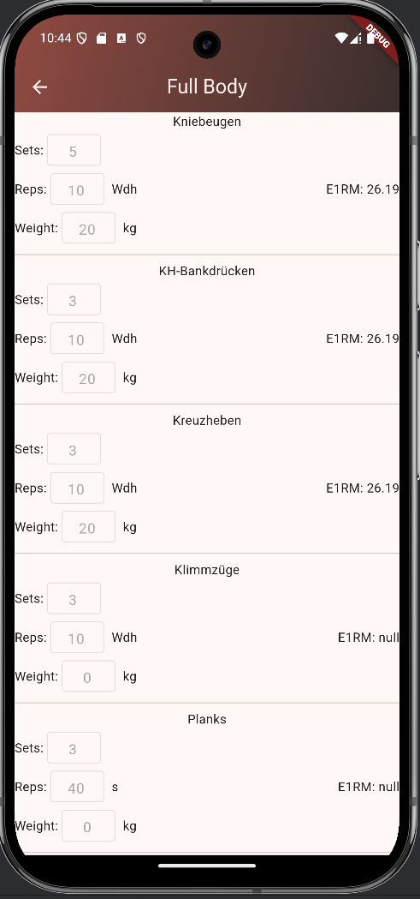
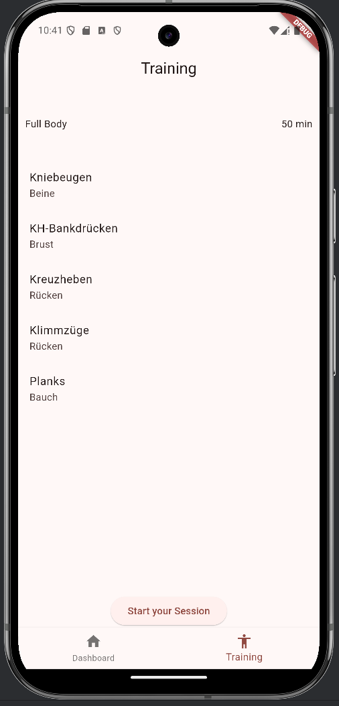
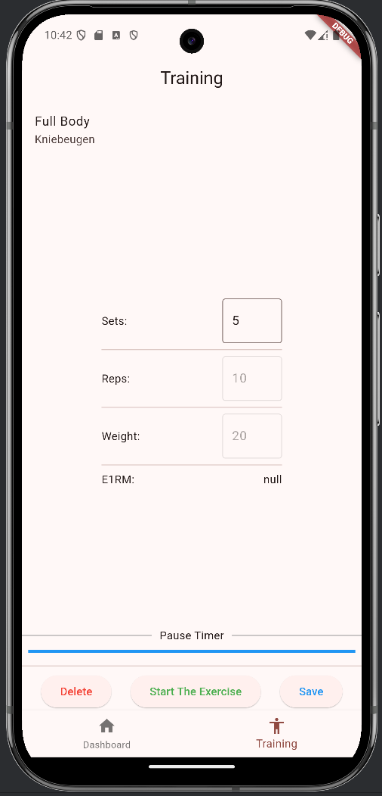
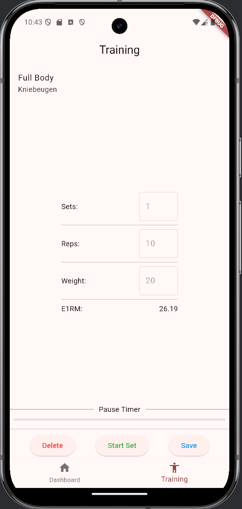

# mci_test POC APP

MCI – Technical Interview – Model Task

## Login & Register in 1 Screen
You can swap between modes by pressing the blue link below the main button. \
Google Sign in also works.

  
  

## Dashboard Screen
The dashboard display the current active session on top if available and the history of completes sessions below. \
You can tap on the current session to get redirected to the training screen. \
You can hold the session to open the session details panel.

  
  
  

# Session Detail
This panel displays the sets, reps, weights and the E1RM for you last set.

# Training Screen
The training screen will display the training plan if no active session exists.\
If an active session exists, the first exercise will be displayed.\
You can select how many sets you want to do and while you are training you can select how many reps you have done and how heavy you lifted.\
For each set the E1RM will be displayed when you have finished your set.\
After finishing your set the pause timer will start and the textfields are locked.\
You can always close the app or tap out of the screen and you will be able to open your session on the exercise you left.\
You can always cancel your session and the session will be deleted.\
You can manually save your progress with the save button, but the session will save automatically after each exercise.

  
  
  

